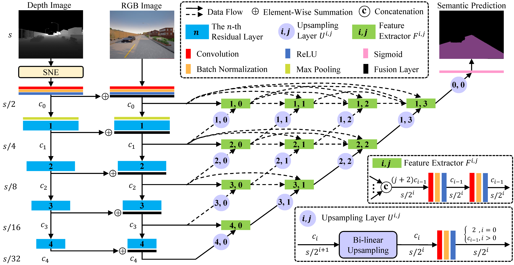

[English](https://github.com/Charmve/SNE-RoadSeg2) | 简体中文

# SNE-RoadSeg2

## 概述
SNE-RoadSeg2基于**SNE-RoadSeg：将表面法线信息纳入语义分割以进行准确的自由空间检测**的[官方pytorch实现](http://www.ecva.net/papers/eccv_2020/papers_ECCV/papers/123750341.pdf)，已被[ECCV 2020](https://eccv2020.eu/)接收，这是他们的[项目主页](https://sites.google.com/view/sne-roadseg)。

在此仓库中，我们为[KITTI道路数据集](http://www.cvlibs.net/datasets/kitti/eval_road.php)提供了训练和测试配置。 此项目源代码已经在Python 3.7，CUDA 10.0，cuDNN 7和PyTorch 1.1环境中测试，并且提供了`Dockerfile`来构建我们使用的docker镜像。

<p align="center">

</p>
<br>

<p align="center">

</p>

## Setup
请根据以下文件夹结构设置KITTI道路数据集和预训练的权重：

```
SNE-RoadSeg
 |-- checkpoints
 |  |-- kitti
 |  |  |-- kitti_net_RoadSeg.pth
 |-- data
 |-- datasets
 |  |-- kitti
 |  |  |-- training
 |  |  |  |-- calib
 |  |  |  |-- depth_u16
 |  |  |  |-- gt_image_2
 |  |  |  |-- image_2
 |  |  |-- validation
 |  |  |  |-- calib
 |  |  |  |-- depth_u16
 |  |  |  |-- gt_image_2
 |  |  |  |-- image_2
 |  |  |-- testing
 |  |  |  |-- calib
 |  |  |  |-- depth_u16
 |  |  |  |-- image_2
 |-- examples
 ...
```

可以从[KITTI道路数据集](http://www.cvlibs.net/datasets/kitti/eval_road.php)下载`image_2`，`gt_image_2`和`calib`。 我们根据KITTI道路数据集提供的LiDAR数据实现`depth_u16`，可以从[这里](https://drive.google.com/file/d/1-GHge0p7JdTncmWedTTfmkrQvyNzatZo/view?usp=sharing)下载。 请注意，`depth_u16`是uint16数据格式，并且实际深度（以米为单位）可以通过``double(depth_u16)/1000``来获得。 此外，我们的**SNE-RoadSeg-152**的预训练权重`kitti_net_RoadSeg.pth`可以从[这里](https://drive.google.com/file/d/1hvyeLo-C7k6c998xh0G1QOVxeHRlCr8i/view?usp=sharing)下载。

## 如何使用

### 运行一个示例
我们在`examples`中提供了一个示例。 要运行它，您只需要如上所述设置`checkpoints`文件夹即可。 然后，运行以下脚本：
```
bash ./scripts/run_example.sh
```

然后您将在`examples`中看到`normal.png`，`pred.png`和`prob_map.png`。 `normal.png`是我们SNE的正常估算；`pred.png`是我们的SNE-RoadSeg进行的自由空间预测； `prob_map.png`是我们的SNE-RoadSeg预测的概率图。

### 为KITTI做提交测试
对于KITTI提交，您需要如上所述设置`checkpoints`和`datasets/kitti/testing`文件夹。 然后，运行以下脚本：

```
bash ./scripts/test.sh
```
您将在`testresults`中获得预测结果。 之后，您可以按照[提交说明 submission instructions](http://www.cvlibs.net/datasets/kitti/eval_road.php)将预测结果转换为BEV透视图以进行提交。

如果一切正常，您将获得**URBAN**的MaxF分数**96.74**。 请注意：这是我们重新实现的权重，与本文中报告的权重非常相似（对于**URBAN**，MaxF得分为**96.75**）。


### 在KITTI数据集上作训练
为了进行训练，您需要如上所述设置`datasets/kitti`文件夹。 您可以根据需要将原始训练集分为新的训练集和验证集。 然后，运行以下脚本：
```
bash ./scripts/train.sh
```
权重将保存在`checkpoints`中，包含损耗曲线以及验证集性能的张量板记录将保存在`runs`中。 注意：如果我们将使用我们的SNE模型，`train.sh`中的`use-sne`可以控制，默认值为True。 如果删除它，我们的RoadSeg将以深度图像作为输入，并且您还需要删除`test.sh`中的`use-sne`以避免测试时出错。

## 引用

<p align="center">

</p>
[<a href="http://www.ecva.net/papers/eccv_2020/papers_ECCV/papers/123750341.pdf" target="_blank">paper</a>] | [<a href="https://www.youtube.com/watch?v=wWrZhDuh6xc&t=10s" target="_blank">video</a>]

## 致谢
我们的代码受[pytorch-CycleGAN-and-pix2pix](https://github.com/junyanz/pytorch-CycleGAN-and-pix2pix)的启发，非常感谢[Jun-Yan Zhu](https://github.com/junyanz)分享的出色工作。

